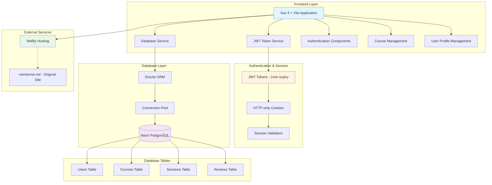

# MentorNet Platform
[](https://app.netlify.com/projects/mentoras/deploys)

> **🤖 AI-Generated Project**: This entire project was developed using AI assistance, showcasing modern AI-powered software development capabilities.

**Connecting learners with mentors, forming a network for personalized guidance and training.**

MentorNet is an **alternative frontend** to the existing [mentorme.md](https://mentorme.md) website, providing a comprehensive platform that enables users to find mentorship, share knowledge, and grow together. It builds a supportive community for skill development and professional growth, featuring a complete course management system with role-based access control.

## 🌟 Features

### 🔐 **Authentication & Security**
- **JWT-Based Authentication**: Secure token-based login system with PostgreSQL backend
- **1-Minute Sessions**: Short-lived JWT tokens for enhanced security
- **Secure Storage**: HTTP-only cookies with SameSite protection
- **Role-Based Access**: User roles (Mentee, Mentor, Admin) with appropriate permissions
- **Automatic Logout**: Session expiry with clean token removal

### 👥 **User Management**
- **User Registration**: Create new accounts with username, email, and password
- **Profile Management**: View and edit user profiles
- **Role System**: Three-tier user hierarchy with role-based UI adaptation
- **User Authentication**: Secure login with database validation

### 🎯 **User Interface**
- **Modern Vue 3**: Built with Vue 3 Composition API for optimal performance
- **Responsive Design**: Mobile-first responsive interface with modern UI/UX  
- **Multilingual Support**: i18n support for authentication pages (Romanian, English, Russian)
- **Tabbed Navigation**: Clean interface with courses, mentors, and profile tabs
- **Real-time Validation**: Form validation with user feedback

## 🚀 Tech Stack

- **Frontend**: Vue 3 with Composition API
- **Build Tool**: Vite 7.x for fast development and optimized builds
- **Database**: Neon PostgreSQL with Drizzle ORM
- **Authentication**: JWT-based authentication with secure cookie storage
- **Session Management**: JSON Web Tokens (JWT) with 1-minute expiry
- **Database Connection**: @neondatabase/serverless with connection pooling
- **Schema Management**: Drizzle Kit for migrations and database management
- **Internationalization**: Vue i18n for multi-language support (auth pages only)
- **Styling**: Modern CSS with responsive design principles and mobile-first approach

## 🏗️ Project Architecture



## 🛠️ Installation & Setup

### Prerequisites

- Node.js 20.19+ or 22.12+
- npm or yarn package manager
- Neon PostgreSQL database
- Environment variables configured (see below)

### 1. Clone the Repository

```bash
git clone <repository-url>
cd mentornet
```

### 2. Install Dependencies

```bash
npm install
```

### 3. Configure Environment Variables

Create a `.env` file in the root directory with your database configuration:

```env
NETLIFY_DATABASE_URL=your_neon_database_url
NETLIFY_DATABASE_URL_UNPOOLED=your_neon_unpooled_url
JWT_SECRET=your_jwt_secret_key
```

### 4. Set Up Database Schema

Generate and run database migrations:

```bash
npm run db:generate
npm run db:migrate
```

### 5. Access Database Studio (Optional)

View and manage your database:

```bash
npm run db:studio
```

## 🚀 Development

### Start Development Server

```bash
npm run dev
```

The application will be available at `http://localhost:5173` (or next available port).

### Build for Production

```bash
npm run build
```

## 👥 User Roles & Permissions

### **Mentee (Default Role)**
- Browse and apply to published courses
- Participate in assigned sessions
- Leave reviews and feedback
- View mentor profiles and course details

### **Mentor**
- All mentee capabilities +
- Create and manage courses (draft → publish → archive)
- Review and approve/reject course applications
- Schedule and conduct mentoring sessions
- Set availability and capacity limits (default: 5 mentees)

### **Admin**
- All mentor + mentee capabilities +
- User role management (promote mentee ↔ mentor)
- Course moderation and oversight
- System analytics and reporting
- User account management

## 🔐 Security Features

### **JWT Token-Based Authentication**
The platform implements secure JWT authentication with:

- **Short-lived Tokens**: 1-minute token expiry for enhanced security
- **Secure Storage**: HTTP-only cookies with SameSite protection
- **Automatic Refresh**: Session validation on page load
- **Secure Logout**: Complete token removal and cleanup

### **Database Security**
PostgreSQL-based security with:
- Role-based access control at database level
- Input validation and sanitization
- Prepared statements preventing SQL injection
- Connection pooling with secure credentials
- Environment-based configuration

## 🌍 Internationalization

Multilingual support is available for authentication pages only:

- **Romanian (RO)**: Default language
- **Russian (RU)**: Fallback language support  
- **English (EN)**: Additional language

Language files are located in `src/i18n/locales/`. The main application interface uses English for consistency across roles and features.

## 🛡️ Production Deployment

### Database Configuration
1. Set up Neon PostgreSQL database with connection pooling
2. Configure environment variables for database URLs
3. Run database migrations: `npm run db:migrate`
4. Verify database connection and schema

### Security Checklist
- ✅ Database credentials secured in environment variables
- ✅ JWT secret key configured and secured
- ✅ HTTP-only cookies enabled
- ✅ Session timeout configured (1 minute)
- ✅ SQL injection protection with prepared statements

## 🆘 Support

For support and questions, please contact the development team or create an issue in the repository.
