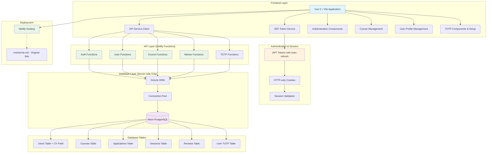

# MentorNet Platform
[](https://app.netlify.com/projects/mentoras/deploys)

> **🤖 AI-Generated Project**: This entire project was developed using AI assistance, showcasing modern AI-powered software development capabilities.

**Connecting learners with mentors, forming a network for personalized guidance and training.**

MentorNet is an **alternative frontend** to the existing [mentorme.md](https://mentorme.md) website, providing a comprehensive platform that enables users to find mentorship, share knowledge, and grow together. It builds a supportive community for skill development and professional growth, featuring a complete course management system with role-based access control.

## 🌟 Features

### 🔐 **Authentication & Security**
- **JWT-Based Authentication**: Secure token-based login system with PostgreSQL backend
- **TOTP Two-Factor Authentication**: Optional time-based one-time password authentication with QR code setup
- **Alternative Login Methods**: Users can choose between password or OTP authentication
- **1-Minute Sessions**: Short-lived JWT tokens for enhanced security
- **Secure Storage**: HTTP-only cookies with SameSite protection
- **Role-Based Access**: User roles (Mentee, Mentor, Admin) with appropriate permissions
- **Rate Limiting**: Protection against brute force attacks on authentication endpoints
- **Automatic Logout**: Session expiry with clean token removal

### 👥 **User Management**
- **User Registration**: Create new accounts with username, email, and password
- **Profile Management**: View and edit user profiles with OTP setup options
- **CV/Resume Management**: Mentors can upload CV links, accessible via clickable profile cards
- **Role System**: Three-tier user hierarchy with role-based UI adaptation
- **User Authentication**: Secure login with database validation and optional OTP

### 🎯 **User Interface**
- **Modern Vue 3**: Built with Vue 3 Composition API for optimal performance
- **Responsive Design**: Mobile-first responsive interface with modern UI/UX  
- **Multilingual Support**: i18n support for authentication pages (Romanian, English, Russian)
- **Tabbed Navigation**: Clean interface with courses, mentors, and profile tabs
- **Login Method Selection**: Toggle between password and OTP authentication methods
- **TOTP Setup Wizard**: Step-by-step QR code generation and verification process
- **Real-time Validation**: Form validation with user feedback

## 🚀 Tech Stack

- **Frontend**: Vue 3 with Composition API
- **Build Tool**: Vite 7.x for fast development and optimized builds
- **Backend**: Netlify Functions (serverless architecture)
- **Database**: Neon PostgreSQL with Drizzle ORM
- **Authentication**: JWT-based authentication with secure cookie storage
- **API Layer**: RESTful API via Netlify Functions with secure database access
- **Session Management**: JSON Web Tokens (JWT) with automatic refresh
- **Database Connection**: @neondatabase/serverless with connection pooling (server-side only)
- **Schema Management**: Drizzle Kit for migrations and database management
- **Internationalization**: Vue i18n for multi-language support
- **Styling**: Modern CSS with responsive design principles and mobile-first approach

## 🏗️ Project Architecture


```mermaid
graph TB
    subgraph "Frontend Layer"
        A[Vue 3 + Vite Application]
        B[JWT Token Service]
        C[API Service Client]
        D[Authentication Components]
        E[Course Management]
        F[User Profile Management]
        TF[TOTP Components & Setup]
    end
    
    subgraph "API Layer (Netlify Functions)"
        G[Auth Functions]
        H[User Functions]
        I[Course Functions]
        J[Mentor Functions]
        TG[TOTP Functions]
    end
    
    subgraph "Authentication & Session"
        K[JWT Tokens with Auto-refresh]
        L[HTTP-only Cookies]
        M[Session Validation]
    end
    
    subgraph "Database Layer (Server-side Only)"
        N[(Neon PostgreSQL)]
        O[Drizzle ORM]
        P[Connection Pool]
    end
    
    subgraph "Database Tables"
        Q[Users Table + CV Field]
        R[Courses Table]
        S[Applications Table]
        T[Sessions Table]
        U[Reviews Table]
        VT[User TOTP Table]
    end
    
    subgraph "Deployment"
        V[Netlify Hosting]
        W[mentorme.md - Original Site]
    end
    
    A --> B
    A --> C
    A --> D
    A --> E
    A --> F
    A --> TF
    
    C --> G
    C --> H
    C --> I
    C --> J
    C --> TG
    
    B --> K
    K --> L
    L --> M
    
    G --> O
    H --> O
    I --> O
    J --> O
    TG --> O
    
    O --> P
    P --> N
    
    N --> Q
    N --> R
    N --> S
    N --> T
    N --> U
    N --> VT
    
    A --> V
    V -.-> W
    
    style A fill:#e1f5fe
    style N fill:#f3e5f5
    style K fill:#fff3e0
    style V fill:#e8f5e8
    style G fill:#e8f5e8
    style H fill:#e8f5e8
    style I fill:#e8f5e8
    style J fill:#e8f5e8
```

## 🛠️ Installation & Setup

### Prerequisites

- Node.js 22.12+ or 26.1+
- `npm` or `pnpm` package manager
- Neon PostgreSQL database
- Environment variables configured (see below)

### 1. Clone the Repository

```bash
git clone <repository-url>
cd mentornet
```

### 2. Install Dependencies

```bash
npm install
```

### 3. Configure Environment Variables

Create a `.env` file in the root directory with your database configuration:

```env
NETLIFY_DATABASE_URL=your_neon_database_url
NETLIFY_DATABASE_URL_UNPOOLED=your_neon_unpooled_url
JWT_SECRET=your_jwt_secret_key
```

## 🚀 Development

### Start Development Server

```bash
npm run dev
```

The application will be available at `http://localhost:5173` (or next available port).

### Build for Production

```bash
npm run build
```

### **Security Features**
- **Rate Limiting**: Maximum 5 attempts per minute per user
- **Token Validation**: 30-second time window with ±30 second tolerance
- **Secure Secret Storage**: Encrypted TOTP secrets in dedicated database table
- **Password Confirmation**: Required for disabling TOTP to prevent unauthorized changes

## 👥 User Roles & Permissions

### **Mentee (Default Role)**
- Browse and apply to published courses
- Participate in assigned sessions
- Leave reviews and feedback
- View mentor profiles and course details
- Access TOTP setup and management in profile settings
- Can be blocked by administrators (restricts all access when blocked)

### **Mentor**
- All mentee capabilities +
- Create and manage courses (draft → publish → archive)
- Review and approve/reject course applications
- Schedule and conduct mentoring sessions
- Set availability and capacity limits (default: 5 mentees)
- Upload and manage CV/resume links (accessible via profile card clicks)
- Can select mentor role during account registration

### **Admin**
- Full system access with comprehensive management capabilities
- **User Management**:
  - View all users in the system with detailed profiles
  - Edit any user's profile information
  - Block/unblock mentee accounts
  - Access dedicated Admin tab in navigation
- **Course Management**:
  - View and edit all courses in the system (including other mentors' courses)
  - Access "All Courses (Admin)" tab for complete course oversight
  - Full course CRUD operations across all mentors
- **System Access**: Cannot be blocked (admin accounts are protected)

## 🔐 Security Features

### **JWT Token-Based Authentication**
The platform implements secure JWT authentication with:

- **Short-lived Tokens**: 1-minute token expiry for enhanced security
- **Secure Storage**: HTTP-only cookies with SameSite protection
- **Automatic Refresh**: Session validation on page load
- **Secure Logout**: Complete token removal and cleanup

### **TOTP Two-Factor Authentication**
Enhanced security through optional OTP implementation:

- **QR Code Setup**: Generate secure OTP secrets with visual QR code scanning
- **Authenticator App Support**: Compatible with Google Authenticator, Authy, and similar apps
- **Alternative Login**: Users can choose password or OTP authentication methods
- **Rate-Limited Access**: Protection against brute force attacks (5 attempts per minute)
- **Secure Management**: Password confirmation required for disabling OTP

### **API & Database Security**
Serverless architecture with enhanced security:
- **Netlify Functions**: Secure server-side API endpoints
- **Database Isolation**: No direct client-to-database connections
- **Input Validation**: Server-side validation and sanitization
- **SQL Injection Protection**: Prepared statements with Drizzle ORM
- **Environment Variables**: Secure credential management
- **Connection Pooling**: Server-side database connection management

## 🌍 Internationalization

Multilingual support is available for authentication pages only:

- **Romanian (RO)**: Default language
- **Russian (RU)**: Fallback language support  
- **English (EN)**: Additional language

Language files are located in `src/i18n/locales/`. The main application interface uses English for consistency across roles and features.

## 🆘 Support

For support and questions, please contact the development team or create an issue in the repository.
